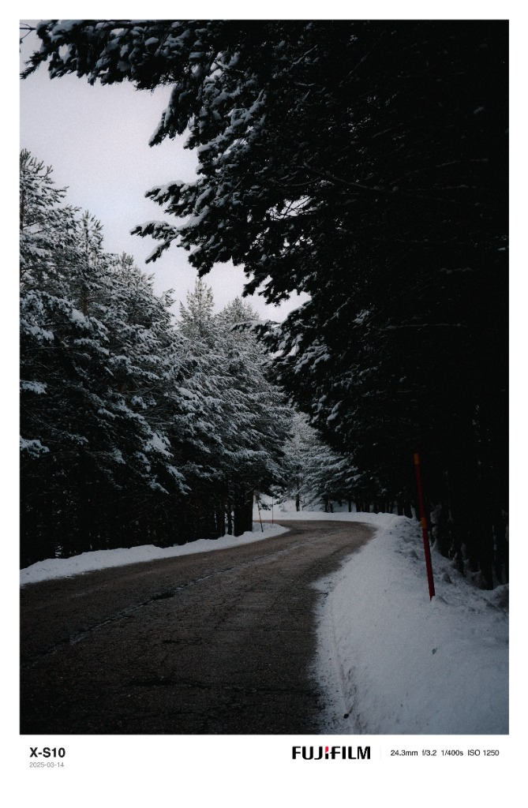

<div align="center">
  
  
  # FrameMark
  
  **The extracted metadata camera frame tool.**
  
  *Elevate your photography with minimalist, metadata-rich borders.*

  [](https://www.framemark.space/)
  [](https://github.com/alexvarelo/FrameMark/blob/main/LICENSE)
  [](#-features)
</div>

<br />

FrameMark is a professional, minimalist web application designed to give your photography a premium gallery look. It automatically extracts EXIF metadata (Camera Model, Aperture, Shutter Speed, ISO, etc.) and renders your photo framed on a clean background with a sophisticated typographic watermark—all processed locally in your browser.

## 🖼️ Examples

| Classic Style | Editorial Style |
| :---: | :---: |
|  |  |
| *Clean, centered branding and metadata.* | *Sophisticated split-metadata layout.* |

## ✨ Features

- **Automatic Metadata Extraction**: Powered by `exifr`, it pulls technical specs directly from your image.
- **Minimalist Design**: A clean, modern UI built with Tailwind CSS v4.
- **High-Resolution Support**: Robust download logic using `toBlob` ensures your images stay sharp.
- **Premium Typography**: Follows professional photography standards with bold branding and subtle technical specs.
- **Instant Previews**: See your framed masterpiece immediately after upload.

## 🚀 Getting Started

### Prerequisites

- Node.js (v18+)
- npm

### Installation

1. Clone the repository:
   ```bash
   git clone https://github.com/alexvarelo/FrameMark.git
   ```
2. Install dependencies:
   ```bash
   npm install
   ```
3. Start the development server:
   ```bash
   npm run dev
   ```

## 🛠️ Built With

- **React** - Frontend framework
- **Vite** - Build tool
- **Tailwind CSS v4** - Styling
- **exifr** - EXIF metadata parsing
- **Lucide React** - Iconography

## 📄 License

MIT © 2025 FrameMark
